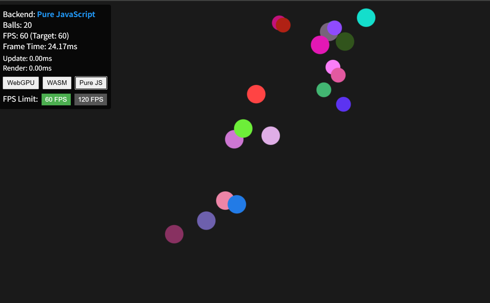

# 🚀 Bouncing Balls: WebGPUパフォーマンス検証 & WASM/JS比較ベンチマーク

[](https://gpuweb.github.io/gpuweb/)
[](https://www.rust-lang.org/)
[](LICENSE)

**100万個のボールを60FPSで動かす** - WebGPU、WASM、Pure JavaScriptの3つのバックエンドを切り替えて、パフォーマンスの違いを体感できる**最先端のWebGPU動作検証・性能ベンチマークプロジェクト**です。



## 💡 開発コンセプト (AIとの協業による設計)

このプロジェクトは、単なるコード生成ではなく、**人間**（**Tane Channel Technology**）が発明した**プロンプトOSフレームワーク**「**TALC for System**」と、**高性能AI**「**Antigravity (Gemini 3 Pro High)**」を組み合わせて遂行されました。

* **TALC for System**: AIの思考プロセスを「**構造化された軸（z軸、ベクトル軸など）**」で厳密に制御し、要件定義からAPI仕様に至るまで、**システムの整合性、拡張性、保守性**を意図的に高めることを可能にしました。
* **シナジー効果**: Gemini 3の卓越したコード生成能力と、TALCの構造的・哲学的な制御が融合することで、WebGPUの**アトミック操作**やWASMの**低レベル描画最適化**を含む複雑なシステムを、論理破綻なく短期間で完成させました。

### 📖 マニュアル

[TALC for System マニュアル (日本語)](https://github.com/tanep3/TAL/blob/main/docs/TALC_for_System_Manual_jp.md)

## 🎯 特徴 & 検証ポイント

* **✅ WebGPU 検証環境**: Compute Shaderの**アトミック操作**（スレッドセーフな分裂処理）や**GPUバッファ転送**を含む、高度な機能を総合的に動作テスト。
* **🚀 GPU並列処理**: WebGPU Compute Shaderで100万個のボールを60FPSで処理
* **⚡ WASM最適化**: Rust + ImageDataピクセルバッファで高速描画
* **📊 リアルタイム測定**: Update/Render時間を個別に表示し、ボトルネックを可視化
* **🔄 バックエンド切り替え**: 実行中にWebGPU/WASM/Pure JSを切り替え可能
* **🎮 FPS制限**: 60FPS/120FPSを選択可能（120Hzモニター対応）

## 🏆 パフォーマンスベンチマーク (検証結果)

**100万個のボール時**:

| Backend | Update | Render | 合計 | FPS | 特徴 |
|---------|--------|--------|------|-----|------|
| **WebGPU** | ~0.5ms | ~1ms | **~1.5ms** | **60 FPS** ✨ | GPU並列処理 |
| **WASM** | ~20-40ms | ~30-60ms | **~50-100ms** | **10-20 FPS** | Rust + ImageData |
| **Pure JS** | ~80-150ms | ~150-200ms | **~230-350ms** | **3-4 FPS** | ベースライン |

> **検証結論**: WebGPUは100万個でも60FPSを維持。WASMはCPU最適化により実用的な速度を実現。Pure JSは限界を示す。

## 🛠️ 技術スタック

* **WebGPU**: Compute Shader（物理演算） + Render Pipeline（描画）
* **Rust/WASM**: 物理演算 + ImageDataピクセルバッファ描画
* **JavaScript**: Canvas 2D API描画 + アニメーションループ制御
* **HTML5 Canvas**: 描画サーフェス

## 📦 セットアップ

### 前提条件

* **Node.js** 18+ （WASM ビルド用）
* **Rust** 1.70+ （WASM ビルド用）
* **wasm-pack** （WASM ビルドツール）
* **WebGPU対応ブラウザ** （Chrome/Edge 113+、推奨）

### インストール

```bash
# リポジトリをクローン
git clone <repository-url>
cd bouncing_balls

# Rustツールチェーンをインストール（未インストールの場合）
curl --proto '=https' --tlsv1.2 -sSf https://sh.rustup.rs | sh

# wasm-packをインストール
cargo install wasm-pack

# WASMをビルド
wasm-pack build --target web

# 開発サーバーを起動
python3 -m http.server 8081
````

### ブラウザで開く

```
http://localhost:8081/index.html
```

## 🎮 使い方

### バックエンド切り替え

画面左上のボタンで切り替え：

  * **WebGPU**: GPU並列処理（最高性能）
  * **WASM**: Rust最適化（高性能）
  * **Pure JS**: JavaScript実装（ベースライン）

### FPS制限

  * **60 FPS**: 標準（60Hzモニター）
  * **120 FPS**: ハイリフレッシュレート（120Hzモニター推奨）

### パフォーマンス測定

リアルタイムで表示される指標：

  * **FPS**: 実際のフレームレート
  * **Frame Time**: フレーム間隔（ms）
  * **Update**: 物理演算時間（ms）
  * **Render**: 描画時間（ms）

## 🏗️ アーキテクチャ

### プラグイン型バックエンド

各バックエンドは共通インターフェースを実装：

```javascript
interface Backend {
    update(): void;           // 物理演算
    render(ctx?): void;       // 描画
    getBallCount(): number;   // ボール数取得
}
```

### データフロー

#### WebGPU

```
GPU Compute Shader (物理演算)
    ↓ (GPUメモリ内)
GPU Render Pipeline (描画)
```

#### WASM

```
Rust Update (物理演算)
    ↓ (共有メモリ)
ImageData Pixel Buffer (ピクセル描画)
    ↓
putImageData (一括転送)
```

#### Pure JS

```
JavaScript Update (物理演算)
    ↓
Canvas 2D API (個別描画)
```

## 🔧 最適化手法

### WebGPU

  * **アトミック操作**: スレッドセーフな分裂処理
  * **データ型の正確性**: f32/u32の混在バグを修正
  * **Workgroup最適化**: 64スレッド/ワークグループ

### WASM

  * **ImageData**: Canvas API呼び出しを10万回→1回に削減
  * **距離の二乗判定**: sqrt演算を排除
  * **円形描画**: ピクセル単位で正確な円を描画

### Pure JS

  * **色グループ化**: fillStyle変更を10万回→数百回に削減
  * **ビット演算**: 色抽出の高速化

## 📚 ドキュメント

  * [要件定義書](./docs/要件定義書.md) - 機能要件、非機能要件
  * [システム設計書](./docs/システム設計書.md) - アーキテクチャ、詳細設計
  * [API仕様書](./docs/API仕様書.md) - バックエンドAPI仕様
  * [TALC\_SA.json](./TALC_SA.json) - システムアーキテクチャ定義

## 🐛 トラブルシューティング

### WebGPUが動作しない

  * Chrome/Edge 113+ を使用してください
  * `chrome://flags/#enable-unsafe-webgpu` を有効化（開発版の場合）
  * 自動的にWASMにフォールバックします

### WASMビルドエラー

```bash
# Rustツールチェーンを更新
rustup update

# wasm-packを再インストール
cargo install wasm-pack --force

# クリーンビルド
rm -rf pkg target
wasm-pack build --target web
```

## 🤝 貢献

プルリクエストを歓迎します！大きな変更の場合は、まずissueを開いて変更内容を議論してください。

## 📄 ライセンス

[MIT](./LICENSE)

## 🙏 謝辞

  * WebGPU仕様: [W3C GPU for the Web Community Group](https://www.w3.org/community/gpu/)
  * Rust/WASM: [wasm-bindgen](https://github.com/rustwasm/wasm-bindgen)

-----

**作成者**: Tane Channel Technology
**作成日**: 2025-12-02
