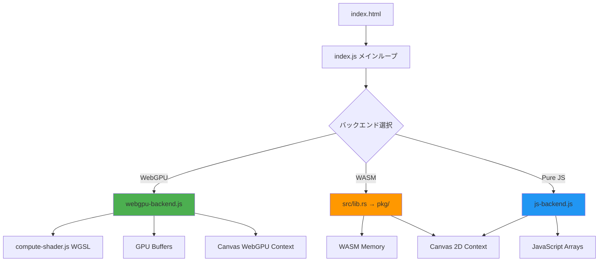
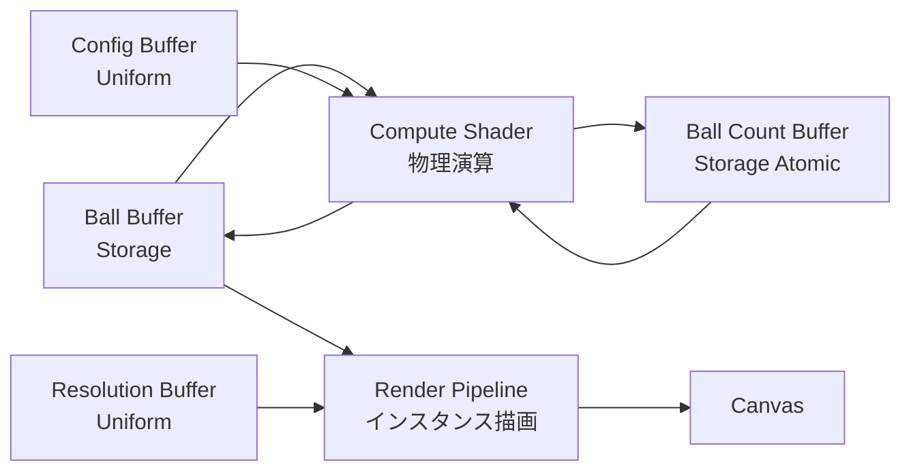
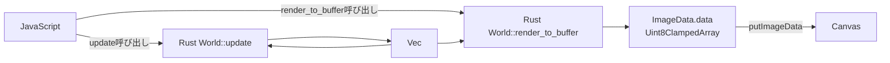
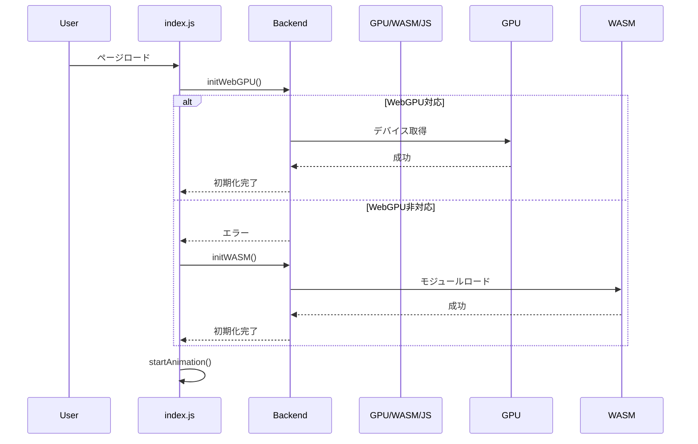
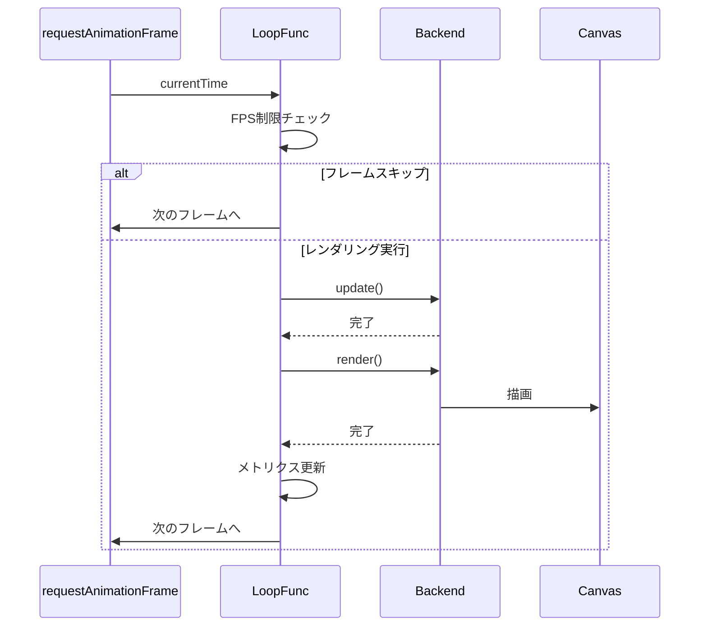
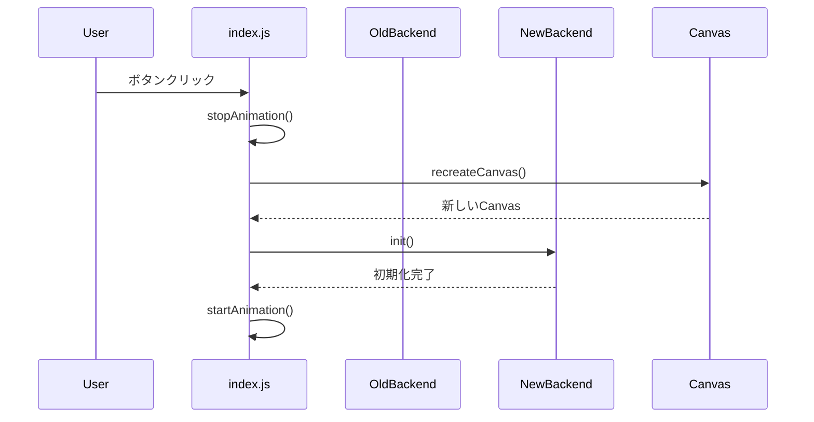

# システム設計書

**プロジェクト名**: Bouncing Balls ハイパフォーマンスシミュレーション  
**バージョン**: 2.0  
**作成日**: 2025-12-02  
**最終更新**: 2025-12-02

---

## 目次

1. [アーキテクチャ概要](#1-アーキテクチャ概要)
2. [バックエンド詳細設計](#2-バックエンド詳細設計)
3. [データフロー](#3-データフロー)
4. [最適化手法](#4-最適化手法)
5. [エラーハンドリング](#5-エラーハンドリング)

---

## 1. アーキテクチャ概要

### 1.1 全体構成



### 1.2 設計原則

#### 1.2.1 関心の分離（Separation of Concerns）

- **ロジック**: 物理演算（update）
- **描画**: レンダリング（render）
- **制御**: アニメーションループ（index.js）

#### 1.2.2 プラグイン型アーキテクチャ

各バックエンドは共通インターフェースを実装：

```typescript
interface Backend {
    update(): void;
    render(ctx?: CanvasRenderingContext2D): void;
    getBallCount(): number;
    readBallCount?(): Promise<number>;
}
```

#### 1.2.3 パフォーマンス最優先

- 複雑さを厭わず、最速の実装を選択
- ボトルネックの徹底的な排除
- ゼロコピー、バッチ処理、GPU並列化

---

## 2. バックエンド詳細設計

### 2.1 WebGPU Backend

#### 2.1.1 アーキテクチャ



#### 2.1.2 データ構造

**Ball構造体（32バイト）**:
```wgsl
struct Ball {
    pos: vec2<f32>,      // 8バイト (x, y)
    vel: vec2<f32>,      // 8バイト (vx, vy)
    radius: f32,         // 4バイト
    color: u32,          // 4バイト (RGB)
    just_split: u32,     // 4バイト (フラグ)
    padding: u32,        // 4バイト (アライメント)
}
```

**Config構造体（16バイト）**:
```wgsl
struct Config {
    width: f32,          // 4バイト
    height: f32,         // 4バイト
    max_balls: u32,      // 4バイト
    split_ratio: f32,    // 4バイト
}
```

#### 2.1.3 Compute Shader処理フロー

```
1. Workgroup起動（64スレッド/ワークグループ）
2. 各スレッドが1個のボールを処理
3. 位置更新（pos += vel）
4. 壁衝突判定
5. 分裂判定：
   - atomicLoad(&ball_count) < max_balls
   - new_radius >= 1.0
   - !just_split
6. 分裂実行：
   - atomicAdd(&ball_count, 1) でスロット予約
   - 戻り値チェック（new_idx + 1 <= max_balls）
   - 失敗時は atomicSub でロールバック
7. just_splitフラグをクリア
```

#### 2.1.4 Render Pipeline

- **トポロジー**: triangle-list
- **インスタンス数**: ball_count
- **頂点シェーダー**: 各ボールの位置・サイズを取得し、6頂点（2三角形）を生成
- **フラグメントシェーダー**: 円形マスク（距離判定）で円を描画

#### 2.1.5 重要な最適化

**データ型の正確な受け渡し**:

```javascript
// ❌ 間違い: 全てFloat32Array
const config = new Float32Array([width, height, maxBalls, splitRatio]);

// ✅ 正しい: 型を分けて送信
const configData = new ArrayBuffer(16);
const f32View = new Float32Array(configData);
const u32View = new Uint32Array(configData);
f32View[0] = width;
f32View[1] = height;
u32View[2] = maxBalls;  // u32として送信
f32View[3] = splitRatio;
```

---

### 2.2 WASM Backend

#### 2.2.1 アーキテクチャ



#### 2.2.2 データ構造

**Ball構造体（Rust、28バイト）**:
```rust
#[repr(C)]
pub struct Ball {
    pub x: f32,          // 4バイト
    pub y: f32,          // 4バイト
    pub vx: f32,         // 4バイト
    pub vy: f32,         // 4バイト
    pub radius: f32,     // 4バイト
    pub color: u32,      // 4バイト
    pub just_split: u32, // 4バイト
}
```

**World構造体（Rust）**:
```rust
pub struct World {
    balls: Vec<Ball>,
    width: f32,
    height: f32,
    max_balls: usize,
    split_ratio: f32,
}
```

#### 2.2.3 物理演算処理フロー

```
1. new_balls = Vec::new()
2. for ball in &mut self.balls:
   - 位置更新
   - 壁衝突判定
   - 分裂判定（current_len + new_balls.len() < max_balls）
   - 分裂実行（new_ballsに追加）
   - just_splitフラグをクリア
3. self.balls.append(&mut new_balls)
```

#### 2.2.4 描画処理フロー（ImageData）

```
1. buffer.chunks_exact_mut(4) で背景クリア（RGBA: 26, 26, 26, 255）
2. for ball in &self.balls:
   - バウンディングボックス計算
   - for py in y_min..y_max:
       for px in x_min..x_max:
           - 距離の二乗を計算（dx² + dy²）
           - if dist² <= r²:
               - buffer[idx] = red
               - buffer[idx+1] = green
               - buffer[idx+2] = blue
               - buffer[idx+3] = 255
```

#### 2.2.5 重要な最適化

**ImageDataによるゼロコピー**:

```javascript
// ❌ 従来: 10万回のCanvas API呼び出し
for (let i = 0; i < 100000; i++) {
    ctx.fillStyle = color[i];
    ctx.fillRect(x[i], y[i], r[i]*2, r[i]*2);
}

// ✅ 最適化: 1回のputImageData
const pixelBuffer = ctx.imageData.data;
backend.render_to_buffer(pixelBuffer, width, height);
ctx.putImageData(ctx.imageData, 0, 0);
```

**距離の二乗判定**:

```rust
// ❌ 遅い: sqrt演算
let dist = ((px - cx).powi(2) + (py - cy).powi(2)).sqrt();
if dist <= r { ... }

// ✅ 速い: 二乗のまま比較
let dist_squared = (px - cx).powi(2) + (py - cy).powi(2);
if dist_squared <= r * r { ... }
```

---

### 2.3 Pure JS Backend

#### 2.3.1 データ構造

```javascript
{
    x: number,
    y: number,
    vx: number,
    vy: number,
    radius: number,
    color: number,  // 0xRRGGBB
    justSplit: boolean
}
```

#### 2.3.2 描画最適化（色グループ化）

```javascript
// 色ごとにグループ化
const colorGroups = new Map();
for (const ball of this.balls) {
    if (!colorGroups.has(ball.color)) {
        colorGroups.set(ball.color, []);
    }
    colorGroups.get(ball.color).push(ball);
}

// 同じ色をまとめて描画
for (const [color, balls] of colorGroups) {
    const r = (color >> 16) & 0xFF;
    const g = (color >> 8) & 0xFF;
    const b = color & 0xFF;
    ctx.fillStyle = `rgb(${r},${g},${b})`;
    
    for (const ball of balls) {
        ctx.fillRect(ball.x - ball.radius, ball.y - ball.radius, 
                     ball.radius * 2, ball.radius * 2);
    }
}
```

---

## 3. データフロー

### 3.1 初期化フロー



### 3.2 メインループフロー



### 3.3 バックエンド切り替えフロー



---

## 4. 最適化手法

### 4.1 WebGPU最適化

| 手法 | 詳細 | 効果 |
|------|------|------|
| **アトミック操作** | `atomicAdd/Sub/Load`でスレッドセーフな分裂処理 | 競合状態を排除 |
| **Workgroup最適化** | 64スレッド/ワークグループ | GPU利用率向上 |
| **データ型の正確性** | f32/u32を正しく送信 | バグ修正（max_balls制限） |
| **GPU内完結** | 物理演算→描画をGPUメモリ内で実行 | CPU-GPU転送ゼロ |

### 4.2 WASM最適化

| 手法 | 詳細 | 効果 |
|------|------|------|
| **ImageData** | ピクセルバッファに直接描画 | Canvas API呼び出し 10万回→1回 |
| **距離の二乗判定** | `sqrt()`を排除 | 演算コスト削減 |
| **Release最適化** | `--release`ビルド | Rustコンパイラ最適化 |
| **円形描画** | 距離判定で正確な円 | 視覚的品質向上 |

### 4.3 Pure JS最適化

| 手法 | 詳細 | 効果 |
|------|------|------|
| **色グループ化** | 同じ色をまとめて描画 | fillStyle変更 10万回→数百回 |
| **ビット演算** | RGB抽出に`>>`と`&`を使用 | 文字列処理を排除 |
| **四角形描画** | `fillRect()`で高速化 | `arc()`より高速 |

---

## 5. エラーハンドリング

### 5.1 WebGPU初期化エラー

```javascript
try {
    backend = new WebGPUBackend(canvas, MAX_BALLS, SPLIT_RATIO);
    await backend.init();
} catch (error) {
    console.error('WebGPU initialization failed:', error);
    // WASMにフォールバック
    await initWASM();
}
```

### 5.2 WASM初期化エラー

```javascript
try {
    wasmModule = await init();
    wasmMemory = wasmModule.memory;
} catch (error) {
    console.warn('WASM module failed to load:', error);
    // Pure JSにフォールバック
    await initJS();
}
```

### 5.3 Canvas Context取得エラー

```javascript
ctx = canvas.getContext('2d');
if (!ctx) {
    throw new Error('Failed to get 2D context');
}
```

### 5.4 Canvas再作成（WebGPU/2Dコンテキスト競合）

```javascript
if (currentBackendType === 'webgpu') {
    recreateCanvas();  // 2D contextを取得する前にCanvas再作成
}
ctx = canvas.getContext('2d');
```

---

## 6. パフォーマンス測定

### 6.1 測定ポイント

```javascript
const t0 = performance.now();
backend.update();
const t1 = performance.now();
backend.render();
const t2 = performance.now();

timeUpdateElem.innerText = (t1 - t0).toFixed(2);
timeRenderElem.innerText = (t2 - t1).toFixed(2);
```

### 6.2 FPS計算

```javascript
let renderedFrames = 0;
let lastFpsTime = performance.now();

function loop(currentTime) {
    renderedFrames++;
    
    if (currentTime - lastFpsTime >= 1000) {
        fpsElem.innerText = renderedFrames;
        renderedFrames = 0;
        lastFpsTime = currentTime;
    }
}
```

---

## 7. 将来の拡張性

### 7.1 新しいバックエンドの追加

共通インターフェースを実装すれば、新しいバックエンド（例: WebGL）を追加可能：

```javascript
class WebGLBackend {
    update() { /* ... */ }
    render() { /* ... */ }
    getBallCount() { /* ... */ }
}
```

### 7.2 物理エンジンの拡張

- ボール間衝突
- 重力・摩擦
- 弾性係数

---

**変更履歴**:

| バージョン | 日付 | 変更内容 |
|-----------|------|---------|
| 1.0 | 2025-11-XX | 初版（WASMのみ） |
| 2.0 | 2025-12-02 | WebGPU/Pure JS追加、ImageData最適化、詳細設計追加 |
